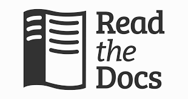

Nagłówek poziom 1
================

Nagłówek poziom 2
----------------

Nagłówek poziom 3
~~~~~~~~~~~~~~~~

Nagłówek poziom 4
^^^^^^^^^^^^^^^^

akapit

.. note::

   To jest notatka.

.. tip::

   To jest wskazówka

To jest kod w jednym wierszu: ``print("Hello World")``

A oto kod blokowy:

    def hello():
        print("Hello, World!")

Wróć do sekcji :ref:`nagłówek poziom 1`.

1. Pierwszy punkt
2. Drugi punkt
3. Trzeci punkt

* Pierwszy element
* Drugi element
* Trzeci element

Python
   :definicja: Język programowania.

+------------+-----------+------------+
| Nagłówek 1 | Nagłówek 2| Nagłówek 3 |
+------------+-----------+------------+
| Komórka 1  | Komórka 2 | Komórka 3  |
+------------+-----------+------------+
